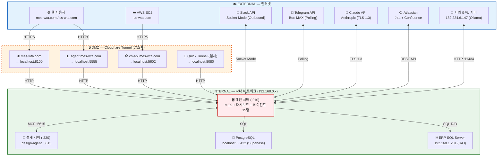
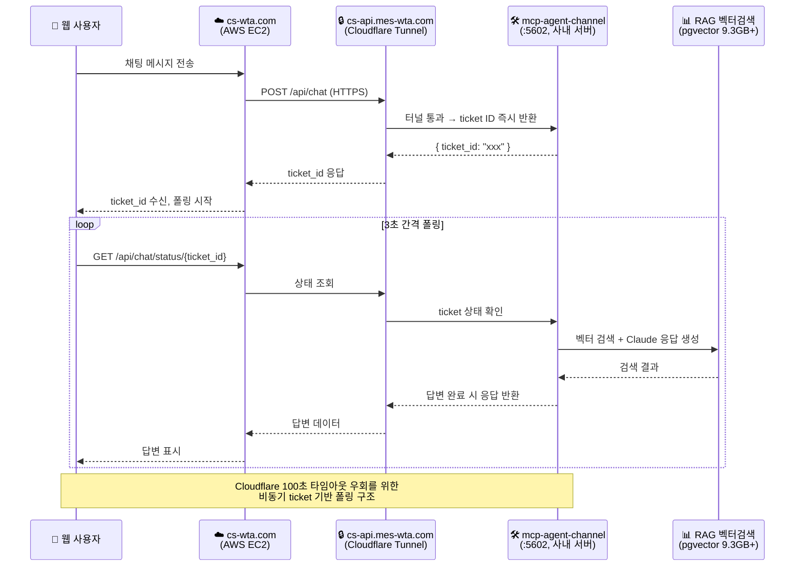
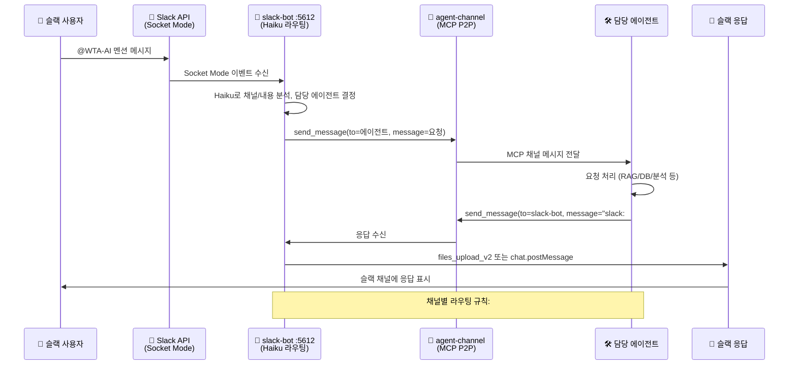
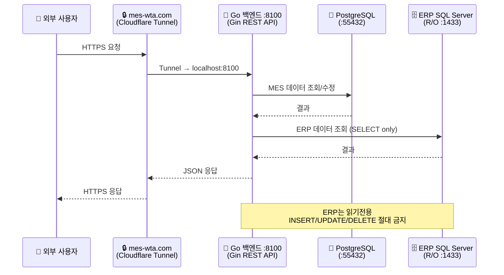
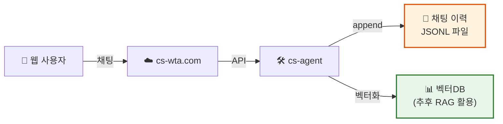
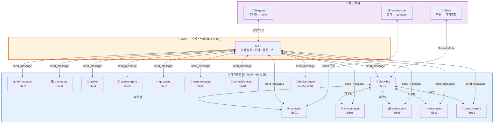

# WTA 네트워크/인프라 구성도

**CONFIDENTIAL — INTERNAL USE ONLY**

(주)윈텍오토메이션 생산관리팀 (AI운영팀) | 최종 업데이트: 2026-04-03

---

## 1. 서버 구성

### 사내 메인 서버 — `192.168.0.210`

| 포트 | 서비스 | 비고 |
|------|--------|------|
| :8100 | MES Go 백엔드 (Gin REST API + WebSocket) | |
| :5555 | 에이전트 대시보드 (Python Flask) | |
| :5600 | MAX 오케스트레이터 (MCP) | |
| :5601~5613 | MCP 에이전트 채널 (15명) | |
| :5612 | slack-bot (Slack Socket Mode) | |
| :8080 | upload-server (파일 업로드) | |

### AWS EC2 — `cs-wta.com`

| 포트 | 서비스 | 비고 |
|------|--------|------|
| :443 | csagent 프론트엔드 (React SPA) | |
| :8080 | csagent 백엔드 (Go API) | |
| Qdrant | 벡터DB (cs-agent 전용, 로컬dev+prod) | |

> 개발/빌드/배포 전부 dev-agent 단독 담당

### 사외 GPU 서버 — `182.224.6.147`

| 포트 | 서비스 | 비고 |
|------|--------|------|
| :11434 | Ollama API (모델 서빙) | |
| Qwen3 | Qwen3-Embedding-8B (2000차원) | |

> 부품매뉴얼 + CS이력 + WTA매뉴얼 임베딩 전용

### 사내 설계 서버 — `192.168.0.220`

| 포트 | 서비스 | 비고 |
|------|--------|------|
| :5615 | design-agent (MCP 채널) | |

> 메인 서버와 별도 머신, localhost 접근 불가

### PostgreSQL (Supabase) — `localhost:55432`

| 스키마 | 용도 | 비고 |
|--------|------|------|
| public | MES 메인 스키마 (119 페이지 데이터) | |
| csagent | CS 전용 47 테이블 (5,160건) | |
| manual | 벡터DB — documents, wta_documents, qc_documents | |
| hardware | 설비 스키마 15 테이블 | |

> 벡터 총 9.3GB+ | TLS 전송 암호화

### ERP SQL Server — `192.168.1.201:1433`

| 스키마 | 용도 | 비고 |
|--------|------|------|
| mirae | ERP 스키마 (수주, 재고, 원가, 거래처) | |
| - | **읽기전용** — SELECT만 허용 | |

> 사내망 전용, 인터넷 접근 불가 | AI INSERT/UPDATE/DELETE 금지

---

## 2. 네트워크 다이어그램

**범례**
- 🔵 외부/인터넷
- 🟠 DMZ/Tunnel (암호화 경계)
- 🟢 사내 네트워크 (보호 영역)
- 🔴 핵심 서비스
- 🟣 데이터베이스

---

## 3. Cloudflare Tunnel 구성

### MES 터널 (Named Tunnel)

| 도메인 | 목적지 | 용도 | 타입 |
|--------|--------|------|------|
| `mes-wta.com` | `localhost:8100` | MES 프로덕션 (Go 백엔드 + React SPA) | Named |
| `agent.mes-wta.com` | `localhost:5555` | 에이전트 대시보드 (팀 현황/작업큐/모니터링) | Named |
| `cs-api.mes-wta.com` | `localhost:5602` | cs-agent API (cs-wta.com 웹채팅 연동) | Named |
| `*.trycloudflare.com` | `localhost:8080` | upload-server (파일 업로드/다운로드, 임시 URL) | Quick |

> - **Named Tunnel**: 고정 도메인 매핑, Cloudflare DNS 자동 관리
> - **Quick Tunnel**: 임시 URL, 재시작 시 변경됨

---

## 4. 외부 서비스 연동

| 서비스 | 용도 |
|--------|------|
| **Cloudflare** | DNS 관리, Tunnel (HTTPS 프록시), Zero Trust 접근제어 |
| **Slack** | Bot: WTA-AI, Socket Mode (Outbound), 채널별 AI 라우팅 |
| **Telegram** | Bot: MAX, 부서장 ↔ MAX 소통, 명령어 제어 (/stop, /start) |
| **Jira / Confluence** | 이슈 트래킹, 문서 관리, REST API 연동 |
| **Claude Code** | Anthropic API, 에이전트 15명 두뇌, TLS 1.3 / 30일 삭제 |

---

## 5. 통신 흐름도

### 흐름 1: CS 웹채팅 (cs-wta.com → 사내 cs-agent)

> **비동기 폴링 구조 (2026-04-03 적용)**
> - cs-wta.com(AWS) → Cloudflare Tunnel → mcp-agent-channel(:5602) 로 요청
> - 서버가 ticket ID를 즉시 반환하고, 백그라운드에서 RAG 검색 + Claude 응답 생성
> - 프론트엔드는 3초 간격으로 ticket 상태를 폴링하여 답변 수신
> - Cloudflare의 100초 응답 타임아웃을 우회하기 위한 설계

### 흐름 2: 슬랙 AI 라우팅 (Slack → slack-bot → 에이전트)

> **에이전트 간 통신 구조**
> - slack-bot이 Slack Socket Mode로 메시지 수신
> - agent-channel (MCP HTTP) 기반으로 에이전트 간 P2P 메시지 전송
> - 각 에이전트는 자체 MCP 포트(:5601~:5615)에서 메시지 대기
> - 응답은 slack-bot을 통해 원래 슬랙 채널로 회신

### 흐름 3: MES 외부 접속 (웹 → Cloudflare → 사내 백엔드)

---

## 6. 사용자별 채팅 이력 관리

### JSONL 저장 방식

cs-wta.com 웹채팅의 사용자별 대화 이력은 JSONL(JSON Lines) 형식으로 저장된다.

- 각 대화 세션은 고유 session_id로 관리
- 한 줄에 하나의 JSON 레코드 (질문, 답변, 타임스탬프, 사용자 정보)
- 누적된 이력은 CS RAG 품질 향상을 위한 학습 데이터로 활용 예정
- 저장 경로: `reports/cs-sessions.jsonl`

---

## 7. 포트 전체 목록 (메인 서버 192.168.0.210)

| 포트 | 서비스 | 프로토콜 | 접근 범위 |
|------|--------|----------|-----------|
| :8100 | MES Go 백엔드 (Gin) | HTTP/WS | Tunnel → 외부 공개 |
| :5555 | 에이전트 대시보드 (Flask) | HTTP | Tunnel → 외부 공개 |
| :5600 | MAX 오케스트레이터 | MCP HTTP | localhost 전용 |
| :5601 | cs-agent | MCP HTTP | localhost 전용 |
| :5602 | db-manager / cs-api | MCP HTTP | Tunnel → 외부 공개 |
| :5603 | dev-agent | MCP HTTP | localhost 전용 |
| :5604 | crafter | MCP HTTP | localhost 전용 |
| :5605 | admin-agent | MCP HTTP | localhost 전용 |
| :5606 | nc-manager | MCP HTTP | localhost 전용 |
| :5607 | qa-agent | MCP HTTP | localhost 전용 |
| :5608 | sales-agent | MCP HTTP | localhost 전용 |
| :5609 | issue-manager | MCP HTTP | localhost 전용 |
| :5610 | schedule-agent | MCP HTTP | localhost 전용 |
| :5611 | docs-agent | MCP HTTP | localhost 전용 |
| :5612 | slack-bot | MCP HTTP | localhost 전용 |
| :5613 | control-agent | MCP HTTP | localhost 전용 |
| :5615 | design-agent (별도 서버 .220) | MCP HTTP | 사내망 |
| :5616 | (예비) | - | - |
| :8080 | upload-server | HTTP | Quick Tunnel → 외부 |
| :55432 | PostgreSQL (Supabase) | PostgreSQL | localhost 전용 |

---

## 8. 에이전트 시스템 아키텍처

---

> 📌 이 문서는 인프라 변경 시마다 업데이트됩니다. 최종 업데이트: 2026-04-03
>
> CONFIDENTIAL — (주)윈텍오토메이션 생산관리팀 (AI운영팀)
> 네트워크 구성 변경 시 admin-agent 또는 MAX에게 업데이트 요청
